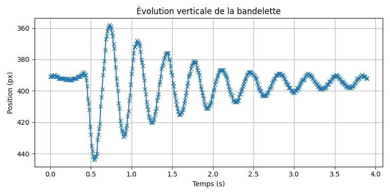

# Instabilité de snap-through d'une bande élastique

## 🎯 Objectif

Ce projet vise à explorer l’instabilité de **flambement** d'une bande élastique, en particulier la **transition entre un état bi-stable et un état mono-stable**. Il a été réalisé dans le cadre d’un stage de L2.

---

## 🧠 Contexte scientifique

Le système étudié est une bande élastique fixée à une extrémité à un point fixe, et à l’autre à un **moteur pas à pas**. En raccourcissant progressivement la longueur effective de la bande, on atteint un **seuil critique** à partir duquel la bandelette bascule brutalement d’un état stable à un autre. Ce phénomène est connu sous le nom de **snap-through instability**.

Le comportement proche du seuil est également étudié via de **petites oscillations**, qui sont analysées par traitement d'image.

---

## 🗂️ Structure du dépôt

```
📁 code/
│   ├── moteur_pas_a_pas.py           # Contrôle moteur (angle / oscillations)
│   ├── traitement_image.py           # Analyse des oscillations à partir d’images
│   ├── suppression_lignes.py         # Nettoyage des images (prétraitement)
│   └── plot_graphs.py                # Génération de graphes
│
📁 data/
│   ├── angles_critique.txt           # Angles mesurés expérimentalement
│   ├── oscillations_brutes/          # Images .tiff des oscillations
│   └── traitement/                   # Données analysées
│
📁 gifs/
│   ├── oscillation_critique.gif
│   └── snapthrough.gif
│
📁 models_3D/
│   ├── support.stl
│   ├── bras_gauche.stl
│   └── bras_droit.stl
│
📄 README.md
📄 requirements.txt
📄 .gitignore
📄 graph_position.jpg
```

---

## ⚙️ Matériel utilisé

- **Moteur pas à pas** : Stepper motor 17HS19-2004S1
- **Microcontrôleur** : Raspberry Pi Pico H
- **Bibliothèques** : `machine.Pin`, `OpenCV`, `matplotlib`, `numpy`, `imageio`, `PIL`, etc.

---

## 🧪 Expérience et scripts

### 🔩 Contrôle moteur (`moteur_pas_a_pas.py`)
- Contrôle d’angle précis du moteur
- Génération d’oscillations autour d’un angle
- Affichage de l’angle actuel
- Le **seuil critique** est déterminé manuellement à partir de l'observation

### 📈 Analyse d’oscillations (`traitement_image.py`)
- Prend une **série d’images `.tiff`**
- Détecte la **position verticale de la bandelette** à chaque image en analysant la **colonne centrale**
- Enregistre les positions dans un fichier `.csv`
- Génére un **GIF** avec :
  - à gauche : l’image de la bandelette
  - à droite : la courbe de position

---

## ▶️ Exemple d’utilisation

```bash
python traitement_image.py --input <dossier contenant les images en .tiff> --output <nom du dossier de sortie> --fps <nombre d'image par seconde>
```

---

## 📊 Résultats

### Exemple de graphe de position verticale de la bandelette :



### GIFs des expériences :

#### Oscillations autour du seuil critique :


#### Instabilité de snap-through :


---

## 📦 Installation

Créer un environnement virtuel et installer les dépendances :

```bash
python -m venv env
source env/bin/activate  # ou .\env\Scripts\activate sur Windows
pip install -r requirements.txt
```

---

## 👤 Auteur

Projet réalisé dans le cadre d’un stage de Licence 2 – 2025.
